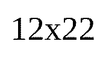

# lbl

`lbl` is a modular command-line toolchain for label printing, written in Rust.

Input is HTML; output is printer-native protocol bytes. The work is split into a
pipeline of small, single-purpose stages. Each stage is both a reusable
**library crate** and a standalone **`lbl-*` binary**, so you can pipe them
together by hand or let the top-level `lbl` command run the whole pipeline for
you.

```text
text/data/HTML
  -> lbl-text         (plain text / CLI args -> authoring HTML)
  -> lbl-template     (data + template -> N authoring HTML, resource fetch)
  -> lbl-transpile-html (custom <qr>/<barcode> + flex -> browser-ready HTML)
  -> lbl-render       (HTML -> raster, 2-pass via headless Chromium)
  -> lbl-dither       (raster -> printer bit depth, photo-aware)
  -> lbl-encode       (bitmap -> protocol bytes; pluggable drivers)
  -> lbl-spool        (internal spooler; queue + cut control)
  -> lbl-device       (USB / network transport)
  -> Printer
```

## Workspace layout

| Crate | Role |
| --- | --- |
| `lbl-core` | Shared types: units, geometry, media, printers, jobs |
| `lbl-config` | Layered configuration (defaults < file < env < CLI) |
| `lbl-catalog` | Curated media SKU database + printer compatibility |
| `lbl-text` | Plain text / CLI args -> authoring HTML |
| `lbl-template` | Data + template -> N HTML, with resource fetching |
| `lbl-transpile-html` | Custom elements + flex -> browser-ready HTML |
| `lbl-render` | HTML -> raster (headless Chromium, two-pass) |
| `lbl-dither` | Raster -> printer bit depth (photo-aware dithering) |
| `crates/drivers/*` | Printer drivers: api, dymo, escpos, zpl, tspl, niimbot, file (virtual), console (terminal) |
| `lbl-encode` | Bitmap -> protocol bytes (driver selection) |
| `lbl-device` | Device discovery + USB/network transport |
| `lbl-spool` | Internal print spooler |
| `lbl` | Orchestrator (subcommands + full-pipeline flows) |
| `lbl-server` | HTTP/WebSocket API for programmatic access and integrations |
| `docs/` | Architecture document + thorough documentation |

## Development

Dev tooling is managed by [mise](https://mise.jdx.dev/). It is the entrypoint for
pinned CLIs — **`just`**, **`pre-commit`**, **`cargo-nextest`**, and the rest listed in
[`mise.toml`](mise.toml).

### Install mise

```bash
# macOS / Linux — see https://mise.jdx.dev/getting-started.html
curl https://mise.run | sh

# Homebrew (macOS / Linux)
brew install mise
```

Activate mise in your shell (add to `~/.zshrc`, `~/.bashrc`, or equivalent):

```bash
eval "$(mise activate zsh)"   # or: bash, fish
```

### Install project tools

From the repo root:

```bash
mise install                              # just, pre-commit, cargo-nextest, …
pre-commit install --install-hooks        # git pre-commit + commit-msg hooks
```

Without shell activation you can run recipes through mise:

```bash
mise exec -- just lint
```

Common recipes (run `just` for the full list):

```bash
just serve                          # run the lbl-server API on the host (127.0.0.1:8787)
just lint                           # lint the Rust workspace (rustc + clippy + rustfmt)
just lint-fix                       # apply autofixes (clippy --fix + rustfmt)
just lint-fix-allow-dirty           # same, but allow a dirty working tree
just test                           # run the Rust test suite (cargo-nextest)
just doc-examples                   # regenerate fixed-size label README/doc previews
just doc-examples-check             # fail if generated doc examples are stale
just maintenance cargo-upgrade      # bump Cargo.toml deps + refresh Cargo.lock
just pre-commit-all                 # run the full pre-commit suite on all files
```

## Building

```bash
cargo build           # build the whole workspace
cargo test            # run the test suite
```

<!-- doc-examples:start -->

## Examples

Each preview highlights a different `lbl print` capability. Commands show
the flags that matter for each example; protocol and output path come from project
config (`lbl.toml`) or the doc generator defaults.

Regenerate from [`docs/examples/manifest.toml`](docs/examples/manifest.toml) with `just doc-examples`.

### Inline mini-syntax

Text mini-syntax embeds QR codes, barcodes, and relative font scaling in one string.
Elements flow in a row; spacing comes from `element_gap_mm` in config (override with `LBL_STYLE__ELEMENT_GAP_MM`).


*DYMO 11352 · 25×54 mm* · [Printing text →](docs/src/guides/printing-text.md#inline-mini-syntax-default)

```console
# default element gap
$ lbl print \
  --text 'Ship {{size:1.2:Alice}}{{barcode:L42}}{{qr:https://track/42}}'

# element gap 8 mm
LBL_STYLE__ELEMENT_GAP_MM=8 $ lbl print \
  --text 'Ship {{size:1.2:Alice}}{{barcode:L42}}{{qr:https://track/42}}'
```

---

### Markdown input

Headings, emphasis, and inline directives compose via `--markdown`.


*NIIMBOT 12×22 mm @ 203 dpi* · [Printing text →](docs/src/guides/printing-text.md)

```console
$ lbl print \
  --markdown $'# Order 44\n\nShip **fast** to dock 4\n\n{{qr:https://track/42}}'
```

---

### Cross-axis alignment

Position content across the label width with `--label-align` (`start`, `center`, or `end`).


*54×15 mm @ 300 dpi* · [Configuration →](docs/src/guides/configuration.md#style-fonts-qr-barcodes)

```console
# align left
# example
$ lbl print --label-align start --text 'align left' --width-mm 54 --length-mm 15 --dpi 300

# align center
# example
$ lbl print --label-align center --text 'align center' --width-mm 54 --length-mm 15 --dpi 300

# align right
# example
$ lbl print --label-align end --text 'align right' --width-mm 54 --length-mm 15 --dpi 300
```

---

### Inner padding

Inner padding (`--padding-mm`, default 2 mm) gutters content from the label edge.


*54×15 mm @ 300 dpi* · [Configuration →](docs/src/guides/configuration.md#padding-and-insets)

```console
# padding 0 (left)
# example
$ lbl print --text Hi --padding-mm 0 --width-mm 54 --length-mm 15 --dpi 300

# padding 4 mm (right)
# example
$ lbl print --text Hi --padding-mm 4 --width-mm 54 --length-mm 15 --dpi 300
```

---

### Config-driven print defaults

When transport and protocol live in `lbl.toml`, the run command only needs label content.


*NIIMBOT 12×40 mm @ 203 dpi* · [Configuration →](docs/src/guides/configuration.md#print-defaults-lbl-print)

[lbl.toml](docs/examples/config-defaults/lbl.toml)

```toml
[print]
protocol  = "niimbot"
bluetooth = "D110"

[render]
orientation = "landscape"
```

```console
# example
$ lbl print --text 'Hello {{qr:https://x/p}}'
```

---

### Supersampling for print quality

Side by side: `--supersample 1` (left) vs `--supersample 8` (right).
More render dots before downscaling yield sharper barcodes and small type.


*DYMO 11352 · 25×54 mm* · [Rendering quality →](docs/src/guides/rendering-quality.md#how-to-set-it)

```console
# supersample 1 (left)
# example
$ lbl print --text '{{barcode:EAN13:4006381333931}} {{size:0.7:SKU 7788}}' --supersample 1

# supersample 8 (right)
# example
$ lbl print --text '{{barcode:EAN13:4006381333931}} {{size:0.7:SKU 7788}}' --supersample 8
```

---

### Catalog media SKU

Pick a die-cut size from the bundled catalog with `--media` instead of raw `--width-mm` / `--length-mm`.


*NIIMBOT 12×40 mm @ 203 dpi* · [Printers & media →](docs/src/guides/printers-media.md#niimbot)

```console
# example
$ lbl print --media 12x40 --text 12x40
```

---

### Another catalog SKU

Another die-cut size from the same catalog — only `--media` and content change.



*NIIMBOT 12×22 mm @ 203 dpi* · [Printers & media →](docs/src/guides/printers-media.md#niimbot)

```console
# example
$ lbl print --media 12x22 --text 12x22
```

---

### Explicit media dimensions

When no catalog SKU fits, pass `--width-mm`, `--length-mm`, and `--dpi` directly.


*48×76 mm @ 300 dpi* · [Printers & media →](docs/src/guides/printers-media.md#media)

```console
$ lbl print \
  --text $'Receipt\nItem ×2  $18.00\nTotal      $36.00' \
  --width-mm 48 \
  --length-mm 76 \
  --dpi 300
```

---

### Complex HTML batch

Rich HTML with photos, QR, and barcodes — Tony and Carmela identity cards from the test suite.


*DYMO 99014 · 54×101 mm* · [Batch printing →](docs/src/guides/batch-printing.md#template--data)

[sopranos.lbl](docs/examples/sopranos/sopranos.lbl)

```text
---json
[
  {
    "name": "Tony Soprano",
    "role": "Boss",
    "department": "DiMeo Crime Family",
    "employee_id": "NJ-BOSS-001",
    "event": "The Sopranos",
    "access": "CAPO DI TUTTI CAPI",
    "badge_number": "001",
    "photo": "https://upload.wikimedia.org/wikipedia/commons/4/4d/Tony_Soprano_%28The_Sopranos_Family_Tree%29.jpg"
  },
  {
    "name": "Carmela Soprano",
    "role": "First Lady",
    "department": "Soprano Household",
    "employee_id": "NJ-CARM-002",
    "event": "The Sopranos",
    "access": "NORTH CALDWELL",
    "badge_number": "002",
    "photo": "https://upload.wikimedia.org/wikipedia/commons/c/c1/Carmela_Soprano_%28The_Sopranos_Family_Tree%29.jpg"
  }
]
---
<div class="lbl-label lbl-col lbl-center">
  <div class="lbl-text" style="font-size:0.62em">{{ event }}</div>
  
  <span class="lbl-text" style="font-size:1.2em;font-weight:bold">{{ name }}</span>
  <span class="lbl-text" style="font-size:0.85em">{{ role }} · {{ department }}</span>
  <qr>https://id.lbl.example/{{ employee_id }}</qr>
  <barcode type="CODE128">{{ employee_id }}</barcode>
  <div class="lbl-row lbl-between" style="width:100%">
    <span class="lbl-text" style="font-size:0.55em">{{ access }}</span>
    <span class="lbl-text" style="font-size:0.55em">#{{ badge_number }}</span>
  </div>
</div>
```

```console
# example
$ lbl print --template sopranos.lbl --template-format html
```

---

## Templating

### HTML template

One HTML layout rendered against a JSON array — name badges with QR for Alice and Bob.


*DYMO 2112286 · 25×25 mm* · [Batch printing →](docs/src/guides/batch-printing.md#template--data)

[card.html](docs/examples/batch-card/card.html)

```html
<div class="lbl-label lbl-row lbl-center">
  <div class="lbl-col">
    <strong>{{ name }}</strong>
    <span>{{ title }}</span>
  </div>
  <qr>{{ url }}</qr>
</div>
```

[people.json](docs/examples/batch-card/people.json)

```json
[
  {
    "name": "Alice",
    "title": "Engineer",
    "url": "https://example.com/alice"
  },
  {
    "name": "Bob",
    "title": "Designer",
    "url": "https://example.com/bob"
  }
]
```

```console
$ cd docs/examples/batch-card
$ lbl print \
  --template card.html \
  --template-format html \
  --data people.json
```

---

### Single-file template and data (HTML)

Data and template in one file — a JSON frontmatter array batches without `--each`.


*DYMO 2112286 · 25×25 mm* · [Batch printing →](docs/src/guides/batch-printing.md#single-file-frontmatter)

[combined.html](docs/examples/batch-combined/combined.html)

```html
---json
[
  { "name": "Alice", "title": "Engineer", "url": "https://example.com/alice" },
  { "name": "Bob", "title": "Designer", "url": "https://example.com/bob" }
]
---
<div class="lbl-label lbl-row lbl-center">
  <div class="lbl-col">
    <strong>{{ name }}</strong>
    <span>{{ title }}</span>
  </div>
  <qr>{{ url }}</qr>
</div>
```

```console
$ lbl print \
  --template combined.html \
  --template-format html
```

---

### Single-file template and data (LBL)

The same frontmatter batch works in a `.lbl` file — HTML template syntax inside.


*DYMO 2112286 · 25×25 mm* · [Batch printing →](docs/src/guides/batch-printing.md#single-file-frontmatter)

[combined.lbl](docs/examples/batch-combined/combined.lbl)

```text
---json
[
  { "name": "Alice", "title": "Engineer", "url": "https://example.com/alice" },
  { "name": "Bob", "title": "Designer", "url": "https://example.com/bob" }
]
---
<div class="lbl-label lbl-row lbl-center">
  <div class="lbl-col">
    <strong>{{ name }}</strong>
    <span>{{ title }}</span>
  </div>
  <qr>{{ url }}</qr>
</div>
```

```console
$ lbl print \
  --template combined.lbl \
  --template-format html
```

---

### Command pipelining

Pipe one JSON object per line into `lbl print` — each line becomes `--data` for one badge.


*DYMO 2112286 · 25×25 mm* · [Batch printing →](docs/src/guides/batch-printing.md#shell-iteration-seq-and-xargs)

```console
$ cd docs/examples/batch-card
# example
$ cat people.ndjson | xargs -n1 lbl print --template card.html --template-format html --data
```

---

## Iterators

### `--one`

Print only the first label from a batch selection.


*DYMO 2112286 · 25×25 mm* · [Batch printing →](docs/src/guides/batch-printing.md#batch-selection)

```console
# example
$ lbl print --template card.html --template-format html --data people.json --one
```

---

### `--index`

Select a label by zero-based index — here, Bob at index 1.


*DYMO 2112286 · 25×25 mm* · [Batch printing →](docs/src/guides/batch-printing.md#batch-selection)

```console
# example
$ lbl print --template card.html --template-format html --data people.json --index 1
```

---

### `--filter`

Keep only labels whose data fields contain a substring (case-insensitive).


*DYMO 2112286 · 25×25 mm* · [Batch printing →](docs/src/guides/batch-printing.md#batch-selection)

```console
# example
$ lbl print --template card.html --template-format html --data people.json --filter Bob
```

---

### `--skip` and `--take`

Skip the first N labels, then print at most M from the remainder.


*DYMO 2112286 · 25×25 mm* · [Batch printing →](docs/src/guides/batch-printing.md#batch-selection)

```console
# example
$ lbl print --template card.html --template-format html --data people.json --skip 1 --take 1
```

<!-- doc-examples:end -->

## Documentation

The documentation is an [mdBook](https://rust-lang.github.io/mdBook/) under
[`docs/`](docs/):

```bash
mdbook serve docs   # or: mdbook build docs
```

- [Architecture overview](docs/src/architecture.md) and
  [ADRs](docs/src/adr/README.md)
- User guides (getting started, text, batch, preview, configuration,
  printers & media)
- Reference (pipeline, data contracts, CLI, catalog, crates)
- [Writing a driver](docs/src/drivers/authoring.md)

API docs: `cargo doc --workspace --no-deps --open`.

## License

License TBD. `lbl` is not affiliated with DYMO or any other manufacturer.
