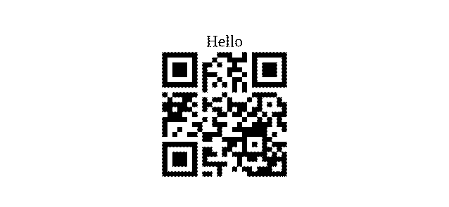
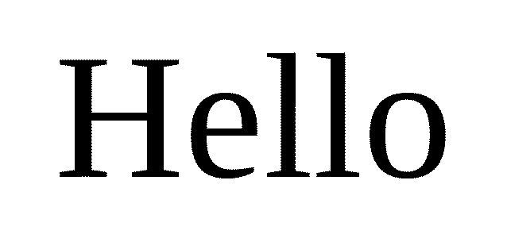
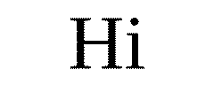
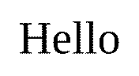

# Fixed-size label examples

Commands show content and layout flags only. Media size, DPI, protocol, and output path come from project config (`lbl.toml`) or environment.

The cases below mirror the guides: getting started, printing text, batch printing, configuration, rendering quality, and printers & media. Regenerate previews with `just doc-examples`.

## DYMO 11352 · 25×54 mm

```bash
lbl print --text 'Hello {{qr:https://example.com}}'
```



## DYMO 11352 · 25×54 mm

```bash
lbl print --text Hello
```



## DYMO 99014 · 54×101 mm

```bash
lbl print --template card.html --template-format html --data people.json --one
```


## NIIMBOT 12×30 mm @ 203 dpi

```bash
lbl print --template 'User #{{ it }}' --data 1 --padding-mm 0
```


## NIIMBOT 12×30 mm @ 203 dpi

```bash
lbl print --text Hi --padding-mm 0
```



## NIIMBOT 12×22 mm @ 203 dpi

```bash
lbl print --text Hello
```



## DYMO 11352 · 25×54 mm · supersample 4

```bash
lbl print --text Hello --supersample 4
```


## NIIMBOT 12×40 mm @ 203 dpi

```bash
lbl print --text Ship --padding-mm 0
```


## 56×89 mm @ 300 dpi

```bash
lbl print --text 'Receipt line'
```


