# Examples

Each preview highlights a different `lbl print` capability. Commands show
the flags that matter for each example; protocol and output path come from project
config (`lbl.toml`) or the doc generator defaults.

Regenerate with `just doc-examples`.

## Complex HTML batch

Rich HTML with photos, QR, and barcodes — Tony and Carmela identity cards from the test suite.

*DYMO 99014 · 54×101 mm* · [Batch printing →](../guides/batch-printing.md#template--data)

[sopranos.lbl](../../examples/sopranos/sopranos.lbl)

```text
---json
[
  {
    "name": "Tony Soprano",
    "role": "Boss",
    "department": "DiMeo Crime Family",
    "employee_id": "NJ-BOSS-001",
    "event": "The Sopranos",
    "access": "CAPO DI TUTTI CAPI",
    "badge_number": "001",
    "photo": "https://upload.wikimedia.org/wikipedia/commons/4/4d/Tony_Soprano_%28The_Sopranos_Family_Tree%29.jpg"
  },
  {
    "name": "Carmela Soprano",
    "role": "First Lady",
    "department": "Soprano Household",
    "employee_id": "NJ-CARM-002",
    "event": "The Sopranos",
    "access": "NORTH CALDWELL",
    "badge_number": "002",
    "photo": "https://upload.wikimedia.org/wikipedia/commons/c/c1/Carmela_Soprano_%28The_Sopranos_Family_Tree%29.jpg"
  }
]
---
<div class="lbl-label lbl-col lbl-center">
  <div class="lbl-text" style="font-size:0.8em">{{ event }}</div>
  
  <span class="lbl-text" style="font-size:1.45em;font-weight:bold">{{ name }}</span>
  <span class="lbl-text" style="font-size:1em">{{ role }} · {{ department }}</span>
  <qr>https://id.lbl.example/{{ employee_id }}</qr>
  <barcode type="CODE128">{{ employee_id }}</barcode>
  <div class="lbl-row lbl-between" style="width:100%">
    <span class="lbl-text" style="font-size:0.68em">{{ access }}</span>
    <span class="lbl-text" style="font-size:0.68em">#{{ badge_number }}</span>
  </div>
</div>
```

```console
$ lbl print --template sopranos.lbl --orientation portrait
# (preview label written to file)
```

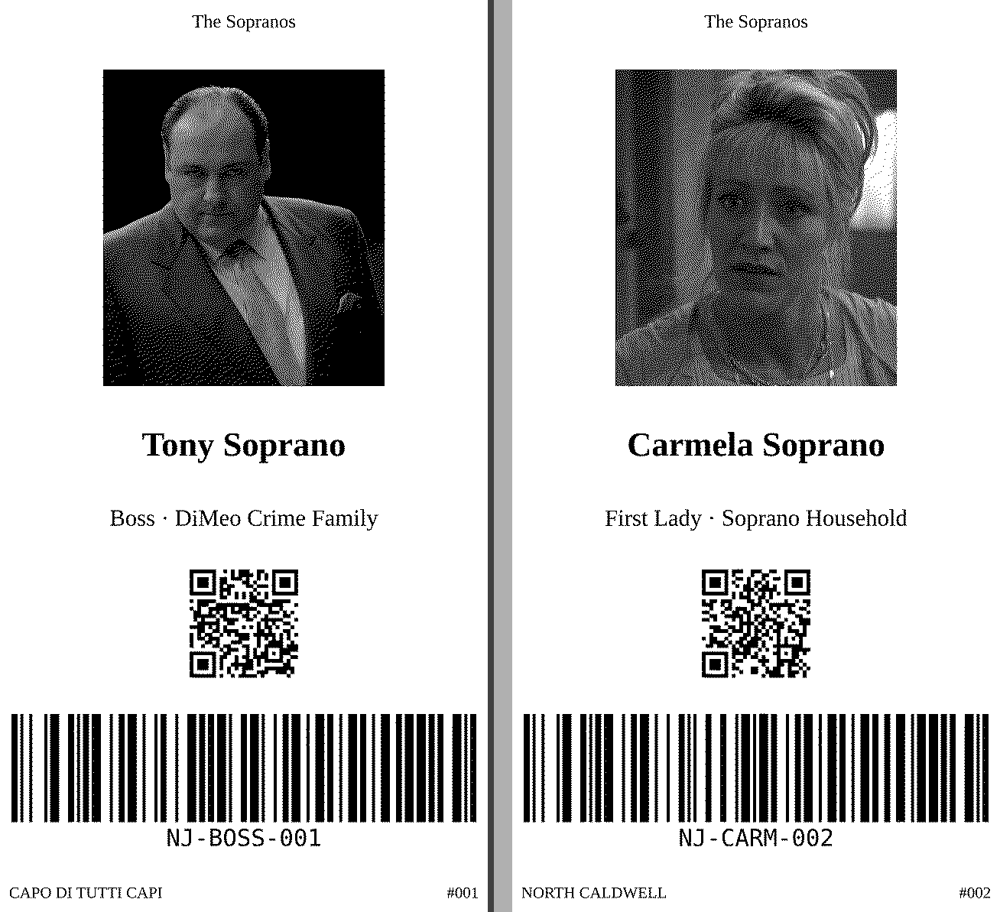
---

## Inline mini-syntax

Text mini-syntax embeds QR codes, barcodes, and relative font scaling in one string.
Elements flow in a row; spacing comes from `element_gap_mm` in config
(see [configuration precedence](docs/src/guides/configuration.md#configuration)).
Override with `--element-gap-mm`, `LBL_STYLE__ELEMENT_GAP_MM`, or other layers.

*120×20 mm* · [Printing text →](../guides/printing-text.md#inline-mini-syntax-default)

```console
# default element gap
$ lbl print \
  --text 'Text {{size:2.5:Title}}{{barcode:Barcode}}{{qr:QR}}'

# element gap 8 mm
$ lbl print \
  --text 'Text {{size:2.5:Title}}{{barcode:Barcode}}{{qr:QR}}' \
  --element-gap-mm 8
```

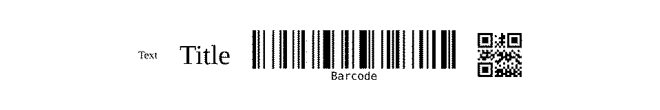
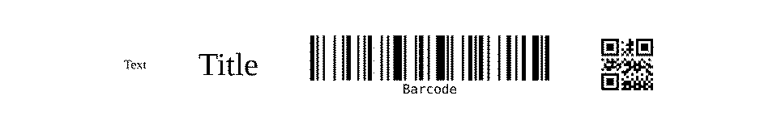
---

## Markdown input

Headings, emphasis, and inline directives compose via `--markdown`.

*NIIMBOT 12×40 mm @ 203 dpi* · [Printing text →](../guides/printing-text.md)

```console
$ lbl print \
  --markdown $'# Order 44\n\nShip **fast**\n\n{{qr:https://track/42}}'
```

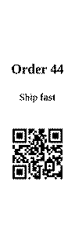
---

## Cross-axis alignment

Position content across the label width with `--label-align` (`start`, `center`, or `end`).

*90×15 mm @ 300 dpi* · [Configuration →](../guides/configuration.md#style-fonts-qr-barcodes)

```console
# align left
$ lbl print --label-align start --text 'align left'
# (preview label written to file)

# align center
$ lbl print --label-align center --text 'align center'
# (preview label written to file)

# align right
$ lbl print --label-align end --text 'align right'
# (preview label written to file)
```


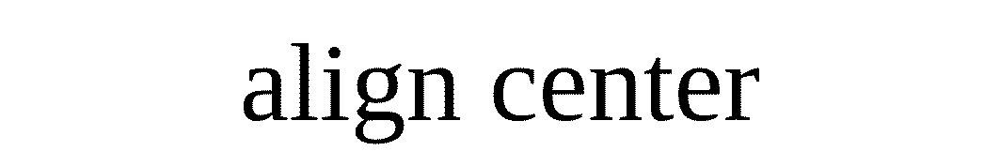

---

## Inner padding

Inner padding (`--padding-mm`, default 2 mm) gutters content from the label edge.

*54×15 mm @ 300 dpi* · [Configuration →](../guides/configuration.md#padding-and-insets)

```console
# padding 0 (left)
$ lbl print --text Hi --padding-mm 0
# (preview label written to file)

# padding 4 mm (right)
$ lbl print --text Hi --padding-mm 4
# (preview label written to file)
```

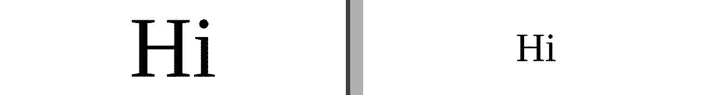
---

## Config-driven print defaults

When transport and protocol live in `lbl.toml`, the run command only needs label content.

*NIIMBOT 12×40 mm @ 203 dpi* · [Configuration →](../guides/configuration.md#print-defaults-lbl-print)

[lbl.toml](../../examples/config-defaults/lbl.toml)

```toml
[print]
protocol  = "niimbot"
bluetooth = "D110"

[render]
orientation = "landscape"
```

```console
$ lbl print --text 'Hello {{qr:https://x/p}}'
# (preview label written to file)
```

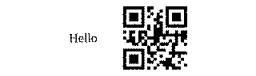
---

## Supersampling for print quality

Side by side: `--supersample 1` (left) vs `--supersample 8` (right).
More render dots before downscaling yield sharper text and fine detail.

*50×108 mm* · [Rendering quality →](../guides/rendering-quality.md#how-to-set-it)

```console
# Supersample 1
$ lbl print --text 'Supersample 1' --supersample 1
# (preview label written to file)

# Supersample 8
$ lbl print --text 'Supersample 8' --supersample 8
# (preview label written to file)
```

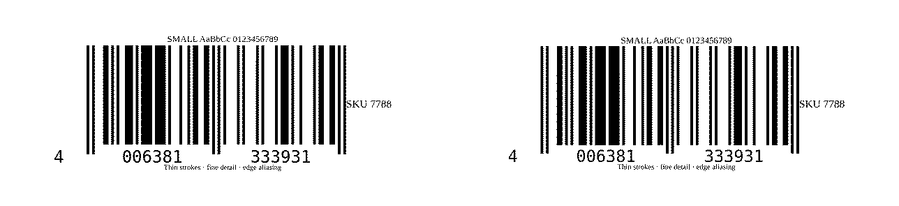
---

## Catalog media SKU

Pick a die-cut size from the bundled catalog with `--media` instead of raw `--width-mm` / `--length-mm`.

*NIIMBOT 12×40 & 12×22 mm @ 203 dpi* · [Printers & media →](../guides/printers-media.md#niimbot)

```console
# 12×40
$ lbl print --media 12x40 --text 12x40
# (preview label written to file)

# 12×22
$ lbl print --media 12x22 --text 12x22
# (preview label written to file)
```

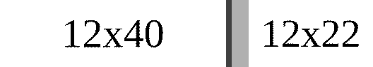
---

## Explicit media dimensions

When no catalog SKU fits, pass `--width-mm` and `--length-mm` directly.

*30×20 mm* · [Printers & media →](../guides/printers-media.md#media)

```console
$ lbl print \
  --text '30×20' \
  --width-mm 30 \
  --length-mm 20
```


---

## Templating

### HTML template

One HTML layout rendered against a JSON array — name badges with QR for Alice and Bob.

*DYMO 2112286 · 25×25 mm* · [Batch printing →](../guides/batch-printing.md#template--data)

[card.html](../../examples/batch-card/card.html)

```html
<div class="lbl-label lbl-col lbl-center">
  <strong>{{ name }}</strong>
  <span>{{ title }}</span>
  <qr>{{ url }}</qr>
</div>
```

[people.json](../../examples/batch-card/people.json)

```json
[
  {
    "name": "Alice",
    "title": "Engineer",
    "url": "https://example.com/alice"
  },
  {
    "name": "Bob",
    "title": "Designer",
    "url": "https://example.com/bob"
  }
]
```

```console
$ cd docs/examples/batch-card
$ lbl print \
  --template card.html \
  --data people.json
```

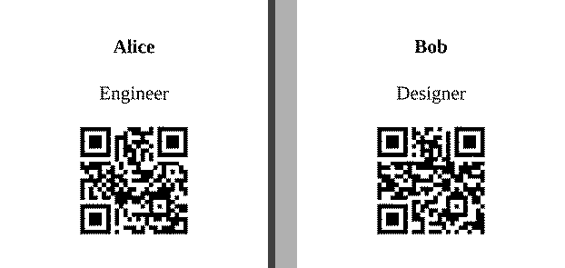
---

### Single-file template and data (HTML)

Data and template in one file — a JSON frontmatter array batches without `--each`.

*DYMO 2112286 · 25×25 mm* · [Batch printing →](../guides/batch-printing.md#single-file-frontmatter)

[combined.html](../../examples/batch-combined/combined.html)

```html
---json
[
  { "name": "Alice", "title": "Engineer", "url": "https://example.com/alice" },
  { "name": "Bob", "title": "Designer", "url": "https://example.com/bob" }
]
---
<div class="lbl-label lbl-col lbl-center">
  <strong>{{ name }}</strong>
  <span>{{ title }}</span>
  <qr>{{ url }}</qr>
</div>
```

```console
$ cd docs/examples/batch-combined
$ lbl print \
  --template combined.html
```


---

### Single-file template and data (LBL)

The same frontmatter batch works in a `.lbl` file — HTML template syntax inside.

*DYMO 2112286 · 25×25 mm* · [Batch printing →](../guides/batch-printing.md#single-file-frontmatter)

[combined.lbl](../../examples/batch-combined/combined.lbl)

```text
---json
[
  { "name": "Alice", "title": "Engineer", "url": "https://example.com/alice" },
  { "name": "Bob", "title": "Designer", "url": "https://example.com/bob" }
]
---
<div class="lbl-label lbl-col lbl-center">
  <strong>{{ name }}</strong>
  <span>{{ title }}</span>
  <qr>{{ url }}</qr>
</div>
```

```console
$ cd docs/examples/batch-combined
$ lbl print \
  --template combined.lbl
```


---

### Command pipelining

Pipe one JSON object per line into `lbl print` — each line becomes `--data` for one badge.

*DYMO 2112286 · 25×25 mm* · [Batch printing →](../guides/batch-printing.md#shell-iteration-seq-and-xargs)

```console
$ cat people.ndjson | xargs -n1 lbl print --template card.html --data
# (preview label written to file)
```

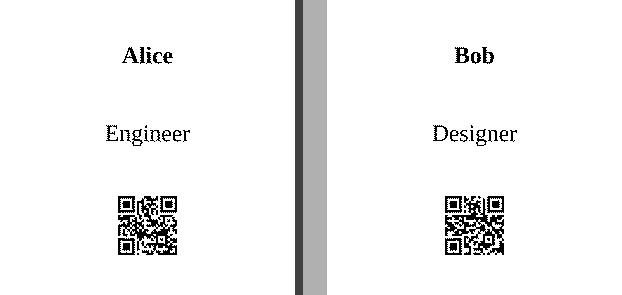
---

## Iterators

### `--one`

Print only the first label from a batch selection.

*DYMO 2112286 · 25×25 mm* · [Batch printing →](../guides/batch-printing.md#batch-selection)

```console
$ cd docs/examples/batch-card
$ lbl print --template card.html --data people.json --one
# (preview label written to file)
```


---

### `--index`

Select a label by zero-based index — here, Bob at index 1.

*DYMO 2112286 · 25×25 mm* · [Batch printing →](../guides/batch-printing.md#batch-selection)

```console
$ cd docs/examples/batch-card
$ lbl print --template card.html --data people.json --index 1
# (preview label written to file)
```


---

### `--filter`

Keep only labels whose data fields contain a substring (case-insensitive).

*DYMO 2112286 · 25×25 mm* · [Batch printing →](../guides/batch-printing.md#batch-selection)

```console
$ cd docs/examples/batch-card
$ lbl print --template card.html --data people.json --filter Bob
# (preview label written to file)
```


---

### `--skip` and `--take`

Skip the first N labels, then print at most M from the remainder.

*DYMO 2112286 · 25×25 mm* · [Batch printing →](../guides/batch-printing.md#batch-selection)

```console
$ cd docs/examples/batch-card
$ lbl print --template card.html --data people.json --skip 1 --take 1
# (preview label written to file)
```


