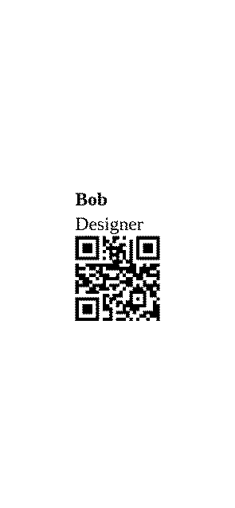

# Examples

Each preview highlights a different `lbl print` capability. Commands show
the flags that matter for each example; protocol and output path come from project
config (`lbl.toml`) or the doc generator defaults.

Regenerate with `just doc-examples`.

## Inline mini-syntax

Text mini-syntax embeds QR codes, barcodes, and relative font scaling in one string.
On wide media the elements flow in a row; spacing comes from `element_gap_mm` in config (override with `LBL_STYLE__ELEMENT_GAP_MM`).

*DYMO 11352 · 25×54 mm* · [Printing text →](../guides/printing-text.md#inline-mini-syntax-default)

```console
# default element gap (left)
$ lbl print \
  --text 'Ship {{size:1.2:Alice}}{{barcode:L42}}{{qr:https://track/42}}' \
  --orientation landscape \
  --qr-size-mm 9 \
  --barcode-height-mm 7 \
  --padding-mm 1

# element gap 8 mm (right)
LBL_STYLE__ELEMENT_GAP_MM=8 $ lbl print \
  --text 'Ship {{size:1.2:Alice}}{{barcode:L42}}{{qr:https://track/42}}' \
  --orientation landscape \
  --qr-size-mm 9 \
  --barcode-height-mm 7 \
  --padding-mm 1
```


---

## Markdown input

Headings, emphasis, and inline directives compose via `--markdown`.

*DYMO 11352 · 25×54 mm* · [Printing text →](../guides/printing-text.md)

```console
$ lbl print \
  --markdown $'# Order 44\n\nShip **fast** to dock 4\n\n{{qr:https://track/42}}' \
  --orientation portrait
```


---

## Batch HTML template

One HTML layout rendered against a JSON array — here, name badges with QR for two people.

*DYMO 11352 · 25×54 mm* · [Batch printing →](../guides/batch-printing.md#template--data)

[card.html](../../examples/batch-card/card.html)

```html
<div class="lbl-label lbl-row lbl-center">
  <div class="lbl-col">
    <strong>{{ name }}</strong>
    <span>{{ title }}</span>
    <qr>{{ url }}</qr>
  </div>
</div>
```

[people.json](../../examples/batch-card/people.json)

```json
[
  {
    "name": "Alice",
    "title": "Engineer",
    "url": "https://example.com/alice"
  },
  {
    "name": "Bob",
    "title": "Designer",
    "url": "https://example.com/bob"
  }
]
```

```console
$ cd docs/examples/batch-card
$ lbl print \
  --template card.html \
  --template-format html \
  --data people.json \
  --orientation portrait \
  --qr-size-mm 9 \
  --padding-mm 1
```



---

## Single-file template and data

Data and template can live in one file — frontmatter holds the records, the body is the layout.

*DYMO 11352 · 25×54 mm* · [Batch printing →](../guides/batch-printing.md#single-file-frontmatter)

[combined.html](../../examples/batch-combined/combined.html)

```html
---toml
[[items]]
name = "Alice"
title = "Engineer"

[[items]]
name = "Bob"
title = "Designer"
---
<div class="lbl-label lbl-row lbl-center">
  <div class="lbl-col">
    <strong>{{ name }}</strong>
    <span>{{ title }}</span>
  </div>
</div>
```

```console
$ cd docs/examples/batch-combined
$ lbl print \
  --template combined.html \
  --template-format html \
  --each /items \
  --orientation portrait \
  --padding-mm 1
```


---

## Linux pipeline batching

Pipe shell output into `lbl print` — `seq | xargs -n1 lbl print … --data` runs once per value.
`{{ it }}` is the scalar passed on each invocation.

*NIIMBOT 12×22 mm @ 203 dpi* · [Batch printing →](../guides/batch-printing.md#shell-iteration-seq-and-xargs)

```console
$ seq 1 3 | xargs -n1 lbl print \
  --template 'User #{{ it }}' \
  --padding-mm 0 \
  --data
```


---

## Cross-axis alignment

Position content across the label width with `--label-align` (`start`, `center`, or `end`).

*DYMO 11352 · 25×54 mm* · [Configuration →](../guides/configuration.md#style-fonts-qr-barcodes)

```console
# start (left)
$ lbl print \
  --text Align \
  --orientation landscape \
  --label-align start

# center (middle)
$ lbl print \
  --text Align \
  --orientation landscape \
  --label-align center

# end (right)
$ lbl print \
  --text Align \
  --orientation landscape \
  --label-align end
```


---

## Inner padding

Inner padding (`--padding-mm`, default 2 mm) gutters content from the label edge. Compare none vs generous padding.

*NIIMBOT 12×30 mm @ 203 dpi* · [Configuration →](../guides/configuration.md#padding-and-insets)

```console
# padding 0 (left)
$ lbl print \
  --text 'ABC 123' \
  --padding-mm 0

# padding 8 mm (right)
$ lbl print \
  --text 'ABC 123' \
  --padding-mm 8
```


---

## Config-driven print defaults

When transport and protocol live in `lbl.toml`, the run command only needs label content.

*NIIMBOT 12×22 mm @ 203 dpi* · [Configuration →](../guides/configuration.md#print-defaults-lbl-print)

[lbl.toml](../../examples/config-defaults/lbl.toml)

```toml
[print]
protocol  = "niimbot"
bluetooth = "D110"

[render]
orientation = "landscape"
```

```console
$ cd docs/examples/config-defaults
# lbl.toml in this directory applies
$ lbl print \
  --text 'Hello {{qr:https://x/p}}'
```


---

## Supersampling for print quality

Side by side: `--supersample 1` (left) vs `--supersample 8` (right).
More render dots before downscaling yield sharper barcodes and small type.

*DYMO 11352 · 25×54 mm* · [Rendering quality →](../guides/rendering-quality.md#how-to-set-it)

[pattern.html](../../examples/supersample/pattern.html)

```html
<div class="lbl-label lbl-col">
  <div class="lbl-text" style="font-size:0.55em">SMALL AaBbCc 0123456789</div>
  <div class="lbl-row lbl-center">
    <barcode type="EAN13">4006381333931</barcode>
    <div class="lbl-text" style="font-size:0.65em">SKU 7788</div>
  </div>
  <div class="lbl-text" style="font-size:0.45em">Thin strokes · fine detail · edge aliasing</div>
</div>
```

```console
$ cd docs/examples/supersample
# supersample 1 (left)
$ lbl print \
  --html pattern.html \
  --orientation landscape \
  --supersample 1

# supersample 8 (right)
$ lbl print \
  --html pattern.html \
  --orientation landscape \
  --supersample 8
```


---

## Catalog media SKU

Pick a die-cut size from the bundled catalog with `--media` instead of passing raw `--width-mm` / `--length-mm`.

*NIIMBOT 12×40 mm @ 203 dpi* · [Printers & media →](../guides/printers-media.md#niimbot)

```console
$ lbl print \
  --media 12x40 \
  --dpi 203 \
  --text 'Dock 4'
```


---

## Explicit media dimensions

When no catalog SKU fits, pass `--width-mm`, `--length-mm`, and `--dpi` directly.

*56×89 mm @ 300 dpi* · [Printers & media →](../guides/printers-media.md#media)

```console
$ lbl print \
  --text $'Receipt\nItem ×2  $18.00\nTotal      $36.00' \
  --width-mm 56 \
  --length-mm 89 \
  --dpi 300
```


